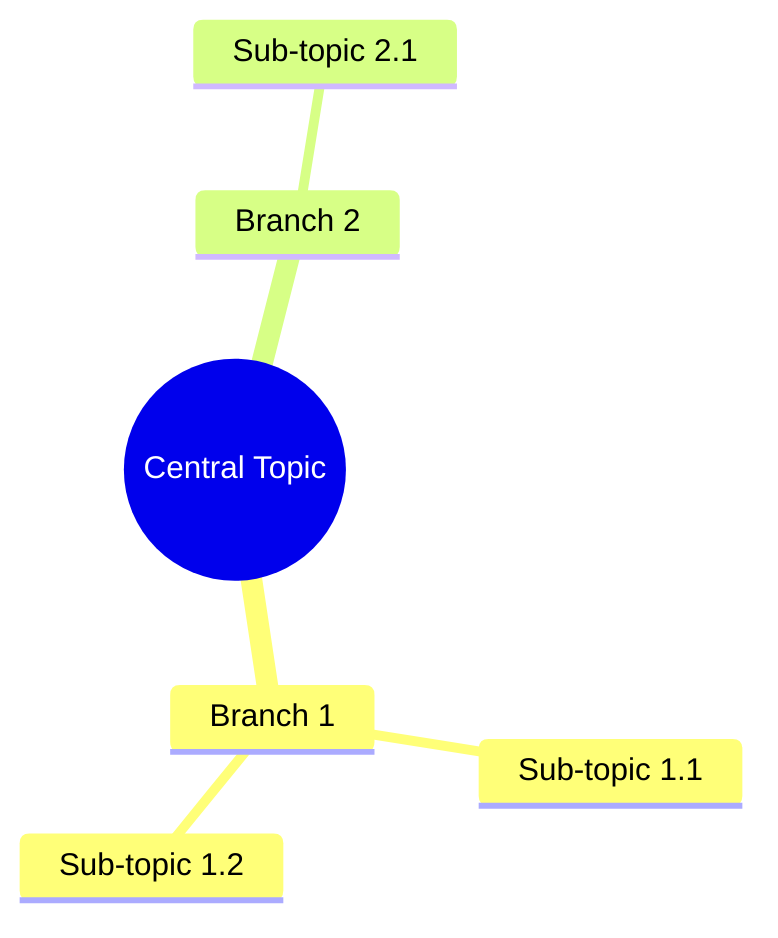

# MMAP - Mind Map Generator Project

## Project Overview

MMAP is a web application that helps users create mind maps, mix maps, and conceptual maps using AI. Users input subject information and optional images, and the AI generates structured diagrams that can be downloaded as PNG files.

**Key Features:**
- AI-powered map generation from text and images
- Support for mind maps, concept maps, and UML-style diagrams
- PNG export functionality
- Simple, single-page interface (no account management needed)

---

## Technology Stack

### Frontend
- **Framework:** Next.js 14+ (App Router)
- **Language:** TypeScript
- **UI Library:** React 18+
- **Styling:** shadcn/ui + Tailwind CSS
- **Diagram Rendering:** Mermaid.js
- **Image Upload:** react-dropzone
- **PNG Export:** html2canvas

### Backend
- **API Routes:** Next.js API Routes (built-in)
- **AI Integration:** Claude API (Anthropic) or OpenAI GPT-4
- **Environment:** Node.js

### Development Tools
- **Package Manager:** pnpm
- **Linting:** ESLint
- **Type Checking:** TypeScript

---

## Project Structure

```
mmap/
├── app/                          # Next.js App Router
│   ├── layout.tsx               # Root layout
│   ├── page.tsx                 # Main page (input form + map display)
│   ├── globals.css              # Global styles
│   └── api/                     # API routes
│       └── generate-map/
│           └── route.ts         # AI map generation endpoint
├── components/                   # React components
│   ├── ui/                      # shadcn/ui components
│   │   ├── button.tsx
│   │   ├── card.tsx
│   │   ├── input.tsx
│   │   ├── textarea.tsx
│   │   ├── select.tsx
│   │   └── ...
│   ├── map-input-form.tsx       # Form for user input
│   ├── map-display.tsx          # Mermaid diagram renderer
│   ├── image-uploader.tsx       # Image upload component
│   └── export-button.tsx        # PNG export functionality
├── lib/                         # Utility functions
│   ├── utils.ts                 # General utilities
│   ├── ai-client.ts             # AI API integration
│   └── diagram-converter.ts     # Convert AI response to Mermaid syntax
├── types/                       # TypeScript type definitions
│   └── index.ts                 # Shared types
├── public/                      # Static assets
├── .env.local                   # Environment variables (API keys)
├── next.config.ts               # Next.js configuration
├── tailwind.config.ts           # Tailwind configuration
├── components.json              # shadcn/ui configuration
├── tsconfig.json                # TypeScript configuration
└── package.json                 # Dependencies
```

---

## Implementation Plan

### Phase 1: Project Setup
1. ✅ Initialize Next.js project with TypeScript and Tailwind
2. Install and configure shadcn/ui
3. Install additional dependencies:
   - Mermaid.js for diagram rendering
   - html2canvas for PNG export
   - react-dropzone for image uploads
   - AI SDK (Anthropic or OpenAI)
4. Set up environment variables for API keys

### Phase 2: Core Components
1. **Map Input Form Component** (`components/map-input-form.tsx`)
   - Text area for subject/information input
   - Map type selector (mind map, concept map, UML)
   - Image upload area (optional)
   - Generate button

2. **Image Uploader Component** (`components/image-uploader.tsx`)
   - Drag-and-drop interface using react-dropzone
   - Image preview
   - Multiple image support

3. **Map Display Component** (`components/map-display.tsx`)
   - Mermaid.js integration
   - Responsive diagram rendering
   - Loading state while generating

4. **Export Button Component** (`components/export-button.tsx`)
   - PNG export using html2canvas
   - Download trigger

### Phase 3: API Integration
1. **AI API Route** (`app/api/generate-map/route.ts`)
   - Receive user input (text, images, map type)
   - Process images (if provided) - convert to base64 or URLs
   - Call AI API with structured prompt
   - Parse AI response into Mermaid syntax
   - Return structured diagram data

2. **AI Client Library** (`lib/ai-client.ts`)
   - Configure API client (Claude or OpenAI)
   - Handle API requests and responses
   - Error handling and retries

3. **Diagram Converter** (`lib/diagram-converter.ts`)
   - Convert AI-generated structure to Mermaid syntax
   - Support different diagram types:
     - Mind maps: `mindmap` syntax
     - Concept maps: `graph` syntax
     - UML diagrams: `classDiagram`, `sequenceDiagram`, etc.

### Phase 4: Main Page Implementation
1. **Home Page** (`app/page.tsx`)
   - Layout with input form on left/top
   - Map display on right/bottom
   - Responsive design for mobile/desktop
   - State management for form data and generated maps

### Phase 5: Polish & Features
1. Add loading states and error handling
2. Implement export to PNG functionality
3. Add example prompts and templates
4. Improve UI/UX with animations and transitions
5. Add dark mode support (shadcn/ui has built-in support)
6. Optimize performance and caching

---

## API Integration Details

### AI Prompt Strategy

The AI will receive a structured prompt like:

```
You are a mind map expert. Convert the following information into a Mermaid diagram.

User Input: [user's text]
Images: [descriptions or analysis of uploaded images]
Map Type: [mind map / concept map / UML]

Generate a valid Mermaid diagram syntax that represents this information as a [map type].
Follow these rules:
- For mind maps, use the mindmap syntax
- For concept maps, use graph TD syntax
- For UML, use appropriate diagram type
- Keep it clear and well-structured
- Return only the Mermaid code, no explanations
```

### Expected Response Format

The AI will return Mermaid syntax like:



---

## Environment Variables

Create `.env.local` file:

```
# AI API Configuration
ANTHROPIC_API_KEY=your_claude_api_key
# OR
OPENAI_API_KEY=your_openai_api_key

# Optional: Choose which AI to use
AI_PROVIDER=anthropic  # or 'openai'
```

---

## Dependencies to Install

```json
{
  "dependencies": {
    "next": "^14.0.0",
    "react": "^18.0.0",
    "react-dom": "^18.0.0",
    "@anthropic-ai/sdk": "^0.20.0",
    "mermaid": "^10.9.0",
    "html2canvas": "^1.4.1",
    "react-dropzone": "^14.2.3",
    "lucide-react": "latest",
    "class-variance-authority": "latest",
    "clsx": "latest",
    "tailwind-merge": "latest"
  },
  "devDependencies": {
    "@types/node": "latest",
    "@types/react": "latest",
    "@types/react-dom": "latest",
    "typescript": "latest",
    "tailwindcss": "latest",
    "eslint": "latest",
    "eslint-config-next": "latest"
  }
}
```

---

## Development Workflow

1. **Start development server:**
   ```bash
   npm run dev
   # or
   pnpm dev
   ```

2. **Access application:**
   Open [http://localhost:3000](http://localhost:3000)

3. **Add shadcn/ui components as needed:**
   ```bash
   npx shadcn-ui@latest add button
   npx shadcn-ui@latest add card
   npx shadcn-ui@latest add input
   # etc.
   ```

---

## Future Enhancements (Out of Scope for MVP)

- User accounts and saved maps
- Collaborative editing
- Multiple export formats (PDF, SVG)
- Custom styling and themes for maps
- Template library
- Share maps via URL
- Undo/redo functionality
- Manual editing of generated maps

---

## Notes

- No authentication/account management in MVP
- Focus on simple, clean UX
- AI does the heavy lifting for map structure
- Users can download and use maps offline
- Responsive design for mobile and desktop
